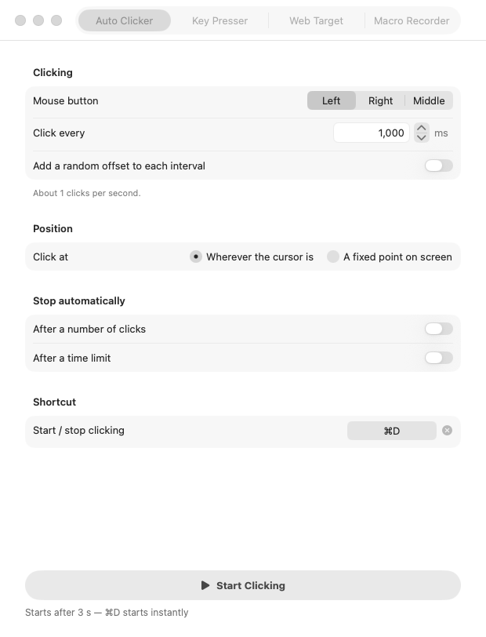

# Macro Maker

A native macOS menu bar app that clicks, presses keys, clicks inside web pages, and records and replays macros.
Written in Swift and SwiftUI. Needs macOS 14 (Sonoma) or later, and runs natively on Apple Silicon and Intel.



## What's new in 2.0

- **Direct-app targeting:** clicks and keystrokes can go to one chosen app in the background — your cursor never moves and the app can be behind other windows.
- **Humanize timing:** jitter the interval, speed, drifts and surprise pauses make automation look like a person.
- **Scheduled starts:** set a clock time and Macro Maker starts the feature then; it disarms itself after firing once.
- **Pause on real input:** your own clicks and keys pause the run ("Paused — you took over"), with optional auto-resume after N idle seconds.
- **Profiles:** save every feature's settings as a named profile and share them as `.macromakerprofile` files.
- **Macro Library:** keep recordings forever, star favorites, assign each its own hotkey, and edit steps right in the table — rename, re-time, move up/down, delete, insert waits of any duration, insert typed text, and fix a click's coordinates.
- **Macro chaining:** a step can run another library macro inline — chains resolve at play time, refuse loops and over-deep nesting before starting, and fail loud when a referenced macro was deleted.
- **Polish:** a sidebar layout, an always-on status line that says what's running, and a first-run onboarding sheet.

| Tab | What it does |
|---|---|
| **Auto Clicker** | Left, right or middle clicks every N ms, with optional jitter. Clicks at the cursor, a fixed point, inside a rectangle, or inside a chosen app in the background. Can burst clicks, hold a button down, stop after N clicks or a time limit — or repeat until you press the stop shortcut (F6). |
| **Key Presser** | Presses any key: letters, digits, `!@#$`, space, enter, tab, arrows, F1–F20, or combos like `cmd+shift+z`. **Auto press** repeats it on an interval; **hold down** keeps it pressed with key repeat. Can type into a chosen app in the background. |
| **Web Target** | Clicks an element in a Safari or Chrome tab, found by CSS selector, XPath or page coordinates. It works by running JavaScript inside the tab, so the tab can be in the background while you use other apps. |
| **Macro Recorder** | Records mouse clicks, key presses, scrolling and cursor movement, replays them with the original timing (repeatable, looped, 0.25×–4× speed, humanized). The built-in step editor renames, re-times, reorders and deletes steps, inserts waits, typed text and **Run Macro** steps (play another library macro at that point — chains refuse loops and nesting past 3, and a deleted reference stops the run with a warning), and edits a click's coordinates. Save/open as `.macromaker`, and keep them in the **Library** with a per-macro hotkey. |

Intended for UI automation and accessibility use. Use of autoclickers may violate the terms of some games and services.

Every feature has a **global keyboard shortcut**: a key combo that works while any app is in front. Everything can also be started from the **menu bar icon**.

---

## Build

### Option A: no Xcode needed (Command Line Tools only)

```bash
xcode-select --install          # once, if `swift --version` doesn't work
./scripts/build-app.sh
open "build/Macro Maker.app"
```

This produces `build/Macro Maker.app`, a universal binary (Apple Silicon + Intel), plus `build/MacroMaker.zip` for sharing. The first build takes about 2 minutes.

### Option B: Xcode

```bash
brew install xcodegen           # once
xcodegen generate               # (re)creates MacroMaker.xcodeproj from project.yml
xcodebuild -scheme MacroMaker -configuration Release -derivedDataPath build/xcode build
open "build/xcode/Build/Products/Release/MacroMaker.app"
```

You can also just `open MacroMaker.xcodeproj` and press ⌘R. `project.yml` is the source of truth for the project: after adding or removing files, run `xcodegen generate` again.

### Tests

```bash
./scripts/test.sh               # or ⌘U in Xcode
```

The tests cover:

- the key parser
- the `.macromaker` file format (a pinned version-1 sample must keep opening)
- recording clean-up
- click timing
- the JavaScript that gets injected, run against a fake page in JavaScriptCore (the JavaScript engine built into macOS)
- the AppleScript bridge

---

## First launch: permissions

macOS blocks apps from controlling your computer until you allow them. Macro Maker shows a banner and has buttons that open the right Settings page for each permission.

| Permission | Needed for | Where |
|---|---|---|
| **Accessibility** | Clicking and pressing keys (all tabs except Web Target) | System Settings ▸ Privacy & Security ▸ Accessibility |
| **Input Monitoring** | Recording macros | System Settings ▸ Privacy & Security ▸ Input Monitoring |
| **Automation** | Web Target (macOS asks the first time it controls a browser) | System Settings ▸ Privacy & Security ▸ Automation |

**Web Target also needs a one-time browser setting:**

- **Safari:** Settings ▸ Advanced ▸ tick *Show features for web developers* (older Safari: *Show Develop menu in menu bar*). Then Develop ▸ Developer Settings… ▸ *Allow JavaScript from Apple Events* (older Safari: the item is directly in the Develop menu).
- **Chrome:** View ▸ Developer ▸ *Allow JavaScript from Apple Events*.

> **Rebuilt the app and a permission stopped working even though its switch is on?**
> macOS ties each permission to one exact build of the app. Unsigned builds count as a new app after every rebuild.
> Fix: select Macro Maker in that list, remove it with **−**, then add it again (or relaunch and allow again).
> Signing with a real certificate (see Distribution) makes permissions survive rebuilds.

---

## Using it

- **Start buttons count down 3 seconds** before starting, so you can move the cursor or switch to the target app. **Shortcuts start instantly.**
- Default shortcuts (change them in Settings or on each tab):

  | Action | Shortcut |
  |---|---|
  | Auto Clicker start/stop | ⌃⌥C |
  | Key Presser start/stop | ⌃⌥K |
  | Web Target start/stop | ⌃⌥W |
  | Record start/stop | ⌃⌥R |
  | Playback start/stop | ⌃⌥P |
  | **Stop everything** | ⌃⌥S |
  | Stop the current run | F6 |

- **"Until the stop shortcut"** on the Auto Clicker and the Recorder's playback options makes a run repeat indefinitely and end the moment you press **F6** (change it in Settings ▸ Keyboard shortcuts) — the run ignores its click/time/repeat limits, because the stop shortcut *is* the stop condition.

- **Fixed point:** click *Pick with Cursor…* and hover over the target for 3 seconds. Coordinates are screen points measured from the top-left corner of the main display.
- **Finding a CSS selector:** in the browser, right-click the element ▸ Inspect. Then right-click the highlighted code ▸ Copy ▸ *Copy selector* (Chrome) or *Selector Path* (Safari).
- **Recording:** clicks, typing, scrolling and cursor movement inside Macro Maker's own windows are not recorded. The shortcut you use to start and stop recording is trimmed out automatically. Cursor moves are thinned to at most one per 100 ms — only the last move before a click matters, not every pixel — and scrolling records each wheel notch.
- **Run Macro steps (chaining):** right-click any step in the table ▸ *Insert Run Macro…* to play another library macro at that point. The referenced macro is resolved at play time, so renaming or re-editing it keeps the chain working. A chain can't repeat a macro and can't nest more than 3 deep — both are refused before playback starts, with the reason shown on the tab; a chain step whose macro was deleted stops the run with a warning naming it, never a silent skip.
- **Dock icon:** hidden by default; Macro Maker lives in the menu bar. Turn the Dock icon on in Settings.
- Your last recording is kept automatically in `~/Library/Application Support/Macro Maker/`.

### `.macromaker` file format (version 2)

```json
{ "format": "macromaker", "version": 2, "name": "Login", "createdAt": "2026-09-16T10:00:00Z",
  "events": [
    { "t": 0,    "type": "mouseDown", "button": "left", "x": 512, "y": 384, "clickCount": 1, "flags": 256 },
    { "t": 0.08, "type": "mouseUp",   "button": "left", "x": 512, "y": 384, "clickCount": 1, "flags": 256 },
    { "t": 1.5,  "type": "keyDown",   "keyCode": 0, "repeat": false, "flags": 256 },
    { "t": 1.6,  "type": "keyUp",     "keyCode": 0, "flags": 256 },
    { "t": 2.0,  "type": "scroll",    "x": 512, "y": 384, "dx": 0, "dy": -24, "flags": 256 },
    { "t": 2.1,  "type": "move",      "x": 600, "y": 400, "flags": 256 },
    { "t": 2.2,  "type": "runMacro",  "macro": "1D5E2B47-…", "flags": 0 } ] }
```

The fields:

- `t`: seconds from the first event
- `x`, `y`: screen points from the top-left of the main display
- `keyCode`: macOS virtual key code (the number macOS assigns to each physical key)
- `flags`: which modifier keys were held (raw `CGEventFlags` value)
- `dx`, `dy` *(since 2.1)*: one scroll-wheel notch's pixel deltas — `dy` is vertical (negative = down), `dx` horizontal
- `macro` *(since 2.1)*: the library id of the macro a `runMacro` step plays inline at that point. Resolved at play time; a file with a `runMacro` step but no `macro` id fails to open (a step that references nothing is corrupt, not blank).
- `text` *(since 2.0)*: optional — when the step editor inserts typed text, the key events carry the character here and are played as Unicode input. v1-era readers ignore this field and load the file fine.

Version 1 files (no `scroll`/`move` steps) keep opening unchanged; Macro Maker 2.0 and older won't open files saved with version 2's new step kinds.

Profiles are separate `.macromakerprofile` files (plain JSON of every feature's settings); the library keeps its files in `~/Library/Application Support/Macro Maker/Macros/` with an index in the app's preferences.

---

## Distribution

| Goal | What to do |
|---|---|
| Run on **your own Mac** | `./scripts/build-app.sh`, then drag `build/Macro Maker.app` to `/Applications`. |
| Give to **a friend, unsigned** | Send `build/MacroMaker.zip`. macOS will block it at first ("can't be opened"). They go to System Settings ▸ Privacy & Security ▸ **Open Anyway**, or run `xattr -dr com.apple.quarantine "/Applications/Macro Maker.app"`. |
| Distribute **properly** (no warnings) | Needs an [Apple Developer Program](https://developer.apple.com/programs/) membership ($99/year) and a *Developer ID Application* certificate. Then sign and notarize (upload to Apple's automated malware scan) with the commands below. |

```bash
# once: save notarization credentials (use an app-specific password from appleid.apple.com)
xcrun notarytool store-credentials macro-maker --apple-id YOU@EXAMPLE.COM --team-id TEAMID

SIGN_IDENTITY="Developer ID Application: Your Name (TEAMID)" ./scripts/build-app.sh
xcrun notarytool submit build/MacroMaker.zip --keychain-profile macro-maker --wait
xcrun stapler staple "build/Macro Maker.app"
ditto -c -k --keepParent "build/Macro Maker.app" build/MacroMaker.zip   # re-zip the stapled app
```

For an Xcode build, set `CODE_SIGN_IDENTITY` and `DEVELOPMENT_TEAM` in `project.yml` instead.

---

## Project structure

```
Sources/MacroMaker/
  App/         Entry point, app delegate, shared AppModel, window management
  Models/      Settings, Macro + file format, key/modifier/hotkey types
  Services/    Event posting, hotkeys, permissions, the four features, AppleScript bridge, file I/O
  Views/       SwiftUI tabs, menu bar panel, settings, reusable components
  Utilities/   Key parsing, keyboard layout lookup, timing, worker thread, recording clean-up, JS builder
Tests/MacroMakerTests/   Unit tests (Swift Testing)
Support/       Info.plist, entitlements, app icon
scripts/       build-app.sh, test.sh, make-icon.swift
project.yml    XcodeGen spec  →  MacroMaker.xcodeproj
Package.swift  SwiftPM manifest (build without Xcode)
```

How the main pieces work:

- **Clicks and key presses** use `CGEvent` (the macOS API for creating mouse and keyboard events). They run on a dedicated high-priority thread with drift-free timing, and pressing Stop wakes that thread immediately. Every stop path (Stop, limits, Stop Everything, quitting the app) releases any key or button that is still held down.
- **Key presser** looks up characters in your *current* keyboard layout, so `!` or `@` presses the right key on US, AZERTY, Dvorak and other layouts. Characters that aren't on your layout are typed as text instead.
- **Global shortcuts** use Carbon `RegisterEventHotKey`. It needs no permission and works while any app is in front.
- **Web Target** compiles one AppleScript per browser once. Each click calls a handler with the selector and JavaScript passed as parameters, so no escaping is needed. The script runs on the main thread because `NSAppleScript` isn't thread-safe. The injected JavaScript fires `pointerdown → mousedown → pointerup → mouseup → click` on the element.
- **Recorder** uses a listen-only event tap: it watches input without being able to block it.

## Limitations

- **Web Target** clicks are synthetic JavaScript events (`isTrusted = false`), and a few sites ignore those. It clicks in the top-level page only, not inside iframes. Only Safari and Google Chrome are supported.
- **Recorder** captures clicks, key presses, scrolling and (throttled) cursor movement. A drag is replayed as press, the recorded moves, then release.
- Replayed clicks land at the same screen positions as when recorded, so a different display arrangement or window position changes where they land.
- Rebuilding an unsigned app resets its permissions (see *First launch*).

## License

[MIT](LICENSE) © 2026 Kheshav
